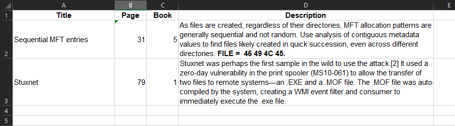

# Indexer
Convert your Excel Spreadsheet exam index to a Word Document for printing.

**Indexer** accepts an Excel table with headings in the following format:



## Installation Guide

### Step 1: Install or Update Python

1. Visit the official Python website: [python.org](https://www.python.org).
2. Download the latest version of Python for your operating system (Windows, macOS, or Linux).
3. Run the installer and follow the instructions provided.
4. During the installation process, make sure to select the option to add Python to your system's PATH environment variable.
5. Once the installation is complete, open a terminal or command prompt and verify the installation by running the following command:

```PowerShell
python --version
```
You should see the Python version number displayed.

### Step 2: Install or Update Required Packages

1. Open a terminal or command prompt.
2. Run the following command to install or update the necessary packages using pip (Python package manager):
```PowerShell
pip install openpyxl python-docx
```
## Running the Script

1. Place the `main.py` script file in a directory of your choice.
2. Ensure that you have your index Excel file (`Index.xlsx`) with the desired data in the same directory as the script.
3. Open a terminal or command prompt and navigate to the directory where the script is located.
4. Run the following command to execute the script:
```PowerShell
python main.py
```
5. The script will process the Excel file and generate a Word document (`Awesome-Index.docx`) with the formatted tables.
6. Once the script completes, you can find the generated Word document in the same directory.

### To do:

- [X] Adjust the column widths for row one to give the title more room.
- [ ] Separate the output tables under alphabetical headings.
- [ ] Create the front cover.

### Updates

- 23 Jun 23 - Changed the layout to make it easier to find the relevant book and page number.